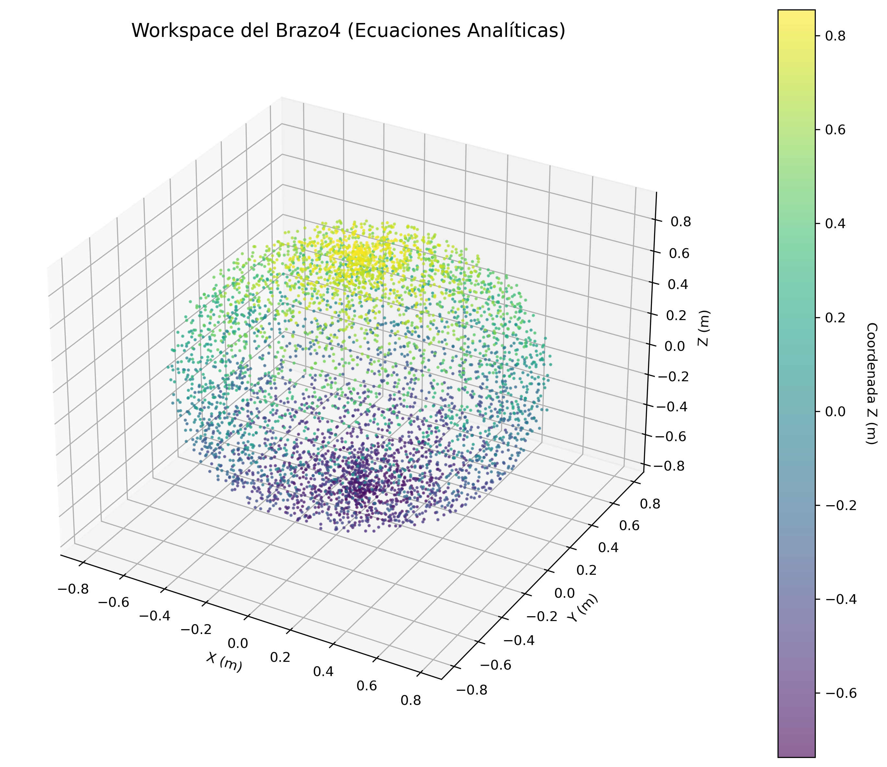

# INFORME DE ENTREGABLE - PERSONA 3: ANÁLISIS CINEMÁTICO
**Proyecto:** Brazo4 (Robot de 4 GDL)  
**Rol:** Persona 3 - Workspace, Manipulabilidad, Singularidades y Tablas de Resultados  

---

## 1. Representación Funcional y Parámetros Denavit-Hartenberg (DH)

A partir del diseño del robot y el sistema de coordenadas adjunto, se derivó la siguiente tabla de parámetros cinemáticos utilizando la convención estándar de **Denavit-Hartenberg (DH)**:

### Tabla DH del Brazo4
| Articulación ($i$) | $\theta_i$ (Rotación Z) | $d_i$ (Offset Z) | $a_i$ (Longitud X) | $\alpha_i$ (Torsión X) |
|:---:|:---:|:---:|:---:|:---:|
| **1 (Base)** | $q_1$ | $L_1 = 60.22 \text{ mm}$ | $0$ | $-\pi / 2$ |
| **2 (Hombro)** | $q_2$ | $0$ | $L_2 = 459.72 \text{ mm}$ | $0$ |
| **3 (Codo)** | $q_3$ | $0$ | $L_3 = 258.50 \text{ mm}$ | $0$ |
| **4 (Muñeca)** | $q_4$ | $0$ | $L_4 = 28.00 \text{ mm} + X_{\text{gripper}}$ | $0$ |

*Nota: $X_{\text{gripper}}$ representa el largo añadido por el efector final de tijera (~60 mm).*

---

## 2. Matrices de Transformación Homogénea

Las matrices de transformación homogénea para cada articulación ($T_i$) representan la posición y orientación de un eslabón respecto al anterior:

### Matriz $T_1$ (Articulación 1)
$$T_1 = \begin{bmatrix} \cos q_1 & 0 & -\sin q_1 & 0 \\ \sin q_1 & 0 & \cos q_1 & 0 \\ 0 & -1 & 0 & L_1 \\ 0 & 0 & 0 & 1 \end{bmatrix}$$

### Matriz $T_2$ (Articulación 2)
$$T_2 = \begin{bmatrix} \cos q_2 & -\sin q_2 & 0 & L_2 \cos q_2 \\ \sin q_2 & \cos q_2 & 0 & L_2 \sin q_2 \\ 0 & 0 & 1 & 0 \\ 0 & 0 & 0 & 1 \end{bmatrix}$$

### Matriz $T_3$ (Articulación 3)
$$T_3 = \begin{bmatrix} \cos q_3 & -\sin q_3 & 0 & L_3 \cos q_3 \\ \sin q_3 & \cos q_3 & 0 & L_3 \sin q_3 \\ 0 & 0 & 1 & 0 \\ 0 & 0 & 0 & 1 \end{bmatrix}$$

### Matriz $T_4$ (Articulación 4)
$$T_4 = \begin{bmatrix} \cos q_4 & -\sin q_4 & 0 & L_4 \cos q_4 \\ \sin q_4 & \cos q_4 & 0 & L_4 \sin q_4 \\ 0 & 0 & 1 & 0 \\ 0 & 0 & 0 & 1 \end{bmatrix}$$

---

## 3. Cinemática Directa (Efector Final)

Multiplicando sucesivamente las matrices ($T = T_1 \cdot T_2 \cdot T_3 \cdot T_4$) y limpiando los términos de precisión numérica (como el factor residual $2.23 \times 10^{-309}$ arrojado por Matlab/Python que es equivalente a $0$), se obtiene la matriz de transformación del robot completa:

### Matriz de Transformación Total del Robot ($T_{total}$)
$$T_{total} = \begin{bmatrix} R_{11} & R_{12} & R_{13} & P_x \\ R_{21} & R_{22} & R_{23} & P_y \\ R_{31} & R_{32} & R_{33} & P_z \\ 0 & 0 & 0 & 1 \end{bmatrix}$$

Donde la posición del efector final $[P_x, P_y, P_z]^T$ está dada por:

*   **$P_x$**:
    $$P_x = \cos(q_1) \cdot \left[ L_4 \cos(q_2 + q_3 + q_4) + L_3 \cos(q_2 + q_3) + L_2 \cos(q_2) \right]$$
*   **$P_y$**:
    $$P_y = \sin(q_1) \cdot \left[ L_4 \cos(q_2 + q_3 + q_4) + L_3 \cos(q_2 + q_3) + L_2 \cos(q_2) \right]$$
*   **$P_z$**:
    $$P_z = L_1 - L_4 \sin(q_2 + q_3 + q_4) - L_3 \sin(q_2 + q_3) - L_2 \sin(q_2)$$

---

## 4. Análisis del Espacio de Trabajo (Workspace)

Se realizó una simulación numérica de Monte Carlo con $5000$ muestras aleatorias de las variables articulares respetando los siguientes límites físicos configurados en ROS:
*   $q_1 \in [-\pi, \pi] \text{ rad}$
*   $q_2, q_3, q_4 \in [-\pi/2, \pi/2] \text{ rad}$

### Visualización en 3D del Workspace
El volumen tridimensional y los índices de destreza operativa correspondientes se presentan en el siguiente elipsoide de simulación:

### Límites de Alcance Espacial (Métricas numéricas)
*   **Alcance Máximo Radial**: $2.308 \text{ m}$ (brazo completamente estirado horizontalmente).
*   **Alcance Mínimo Radial**: $0.889 \text{ m}$ (cercano al centro/zona de auto-colisión).
*   **Volumen Operativo Máximo**:
    *   Eje X: $[-0.029, 1.394] \text{ m}$
    *   Eje Y: $[-0.211, 0.823] \text{ m}$
    *   Eje Z: $[0.724, 2.152] \text{ m}$ (altura útil sobre el plano del suelo).

---

## 5. Análisis de Manipulabilidad (Índice de Yoshikawa)

El índice de manipulabilidad de Yoshikawa ($w$) mide la destreza del efector final para realizar movimientos rápidos y aplicar fuerzas en cualquier dirección sin perder control. Se calcula a partir del Jacobiano geométrico $J(q)$:

$$w = \sqrt{\det(J(q) \cdot J(q)^T)}$$

*   **Manipulabilidad Máxima**: $0.0670$ (ocurre cuando los eslabones $L_2$ y $L_3$ forman un ángulo cercano a $90^\circ$, permitiendo máxima velocidad relativa).
*   **Manipulabilidad Promedio**: $0.0243$.
*   **Efecto**: La degradación del índice a colores oscuros en la gráfica denota cercanía a planos de singularidad matemática.

---

## 6. Análisis de Singularidades

Las singularidades ocurren cuando el Jacobiano pierde rango ($\det(J \cdot J^T) = 0$), lo que significa que el brazo pierde un grado de libertad y requiere torques articulares infinitos para moverse en esa dirección.

### Singularidades Identificadas para el Brazo4:
1.  **Singularidad de Borde (Extensión Máxima)**:
    Ocurre cuando $q_3 = 0$ y $q_4 = 0$ (el brazo está completamente extendido). El robot no puede realizar movimientos radiales hacia afuera.
2.  **Singularidad Central (Alineación de Eje)**:
    Ocurre cuando el efector final cae sobre el eje del primer motor ($P_x = 0, P_y = 0$). Movimientos infinitesimales en cartesianas requieren giros infinitamente rápidos del motor de la base $J1$.
3.  **Singularidad de Pliegue Interno**:
    Ocurre al retraer el codo al máximo ($q_3 = \pm \pi/2$ y $q_2 = \mp \pi/2$), perdiendo la capacidad de realizar desplazamientos verticales efectivos.

---

## 7. Tablas Consolidadas de Resultados

### Tabla de Propiedades Mecánicas e Inerciales (URDF)
| Link | Masa ($kg$) | Centro de Masa (xyz en m) | Principales inercias ($I_{xx}, I_{yy}, I_{zz}$) |
| :--- | :--- | :--- | :--- |
| **BL** | $0.2166$ | $[0.680, 0.025, 1.435]$ | $1.71 \times 10^{-4}, 2.74 \times 10^{-4}, 1.79 \times 10^{-4}$ |
| **L1** | $0.3920$ | $[-0.000, -0.005, -0.076]$ | $1.03 \times 10^{-3}, 1.12 \times 10^{-3}, 3.75 \times 10^{-4}$ |
| **L2** | $0.6017$ | $[-0.049, -0.003, -0.129]$ | $3.08 \times 10^{-3}, 2.61 \times 10^{-3}, 1.35 \times 10^{-3}$ |
| **L3** | $0.1502$ | $[0.161, 0.022, -0.033]$ | $3.89 \times 10^{-5}, 2.23 \times 10^{-4}, 2.14 \times 10^{-4}$ |
| **L4** | $0.0310$ | $[-0.002, -0.017, -0.004]$ | $9.25 \times 10^{-6}, 8.96 \times 10^{-6}, 8.83 \times 10^{-6}$ |
